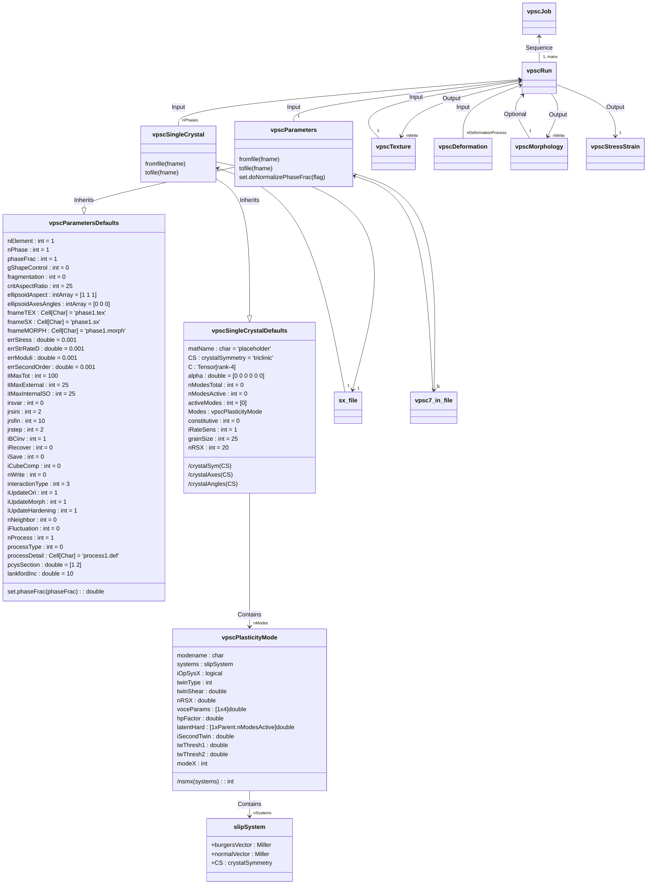

# MTEX-VPSC-API
MATLAB API (relying on the MTEX toolbox) for programmatically setting up and dispatching runs of the viscoplastic self-consistent model code (specifically, the FORTRAN version as implemented by Lebensohn and Tome)

